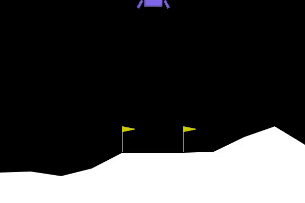

# RL4Games

**Reinforcement Learning with Proximal Policy Optimization (PPO) on Classic Games**

[](https://www.python.org/)
[](https://github.com/DLR-RM/stable-baselines3)
[](https://gymnasium.farama.org/)
[](LICENSE)

---

## Overview

This repository demonstrates **Proximal Policy Optimization (PPO)** applied to four classic reinforcement learning environments:

* **Flappy Bird** (Discrete action space)
* **Lunar Lander** (Continuous control)
* **Car Racing** (CNN-based policy on pixel input)
* **Bipedal Walker** (Curriculum learning: Easy → Hardcore)
---

## What is PPO?

**Proximal Policy Optimization (PPO)** is a state-of-the-art reinforcement learning algorithm belonging to the **policy gradient** family.

### Key Ideas

* Directly optimizes the **policy** (action distribution) instead of Q-values.
* Uses a **clipped surrogate objective** to prevent unstable updates.
* Employs **Generalized Advantage Estimation (GAE)** for variance reduction.
* Balances exploration (via entropy bonus) and exploitation.

### PPO Objective Function

$$
L^{CLIP}(\theta) = \hat{\mathbb{E}}_t \Big[ \min(r_t(\theta) \hat{A}_t, \, \text{clip}(r_t(\theta), 1 - \epsilon, 1 + \epsilon) \hat{A}_t) \Big]
$$

Where:

* $r_t(\theta)$: probability ratio between new and old policy
* $\hat{A}_t$: advantage estimate
* $\epsilon$: clipping parameter (commonly 0.1–0.3)

PPO is **simpler than TRPO**, more stable than vanilla policy gradient, and widely used in practice. 

For more details, see [PPO(Proximal Policy Optimization).pdf](PPO(Proximal%20Policy%20Optimization).pdf).

---

## Flappy Bird

* **Action space**: Discrete (`flap` / `do nothing`)
* **Policy architecture**: MLP
* **Result**: Agent learns to pass through pipes consistently
* **Final model**: `Flappy_Bird/final_model/final_model.zip`

Demo agent:


---

## Lunar Lander

* **Action space**: Continuous (engines with thrust control)
* **Policy architecture**: MLP
* **Result**: Agent learns to safely land on the landing pad
* **Final model**: `Lunar_Lander/final_model/final_model.zip`

Demo agent:



---

## Car Racing

* **Action space**: Continuous (`steering`, `acceleration`, `brake`)
* **Input**: Raw pixels → processed with **CNN**
* **Policy architecture**: CNN + MLP
* **Result**: Agent drives smoothly on procedurally generated tracks
* **Final model**: `Car_Racing/final_model/final_model.txt` (link driver in file txt)

Demo agent:


---

## Bipedal Walker

* **Action space**: Continuous (torques applied to joints)
* **Learning strategy**: **Curriculum Learning**

  * Step 1: Train on **BipedalWalker-v3** (easy terrain)
  * Step 2: Fine-tune on **BipedalWalkerHardcore-v3** (obstacles, pits, stumps)
* **Policy architecture**: Deep MLP with reward shaping
* **Final model**: `Bipedal_Walker/final_model/final_model.txt` (link driver in file txt)

Demo agent:


---

## Results Summary

| Game           | Action Space | Model Type | Avg. Reward*                  |
| -------------- | ------------ | ---------- | ------------------------------ |
| Flappy Bird    | Discrete     | MLP        | ~X (measured by pipe survival) |
| Lunar Lander   | Continuous   | MLP        | ~200+                          |
| Car Racing     | Continuous   | CNN + MLP  | ~600+                          |
| Bipedal Walker | Continuous   | Deep MLP   | ~300 (Easy), ~250 (Hardcore)   |

\* Results may vary depending on random seeds, training duration, and hyperparameters.

---

## Getting Started

### 1. Clone the repo

```bash
git clone https://github.com/BienKieu1411/RL4Games.git
cd RL4Games
```

### 2. Install dependencies

```bash
# Install per game
pip install -r Flappy_Bird/requirements.txt
pip install -r Lunar_Lander/requirements.txt
pip install -r Car_Racing/requirements.txt
pip install -r Bipedal_Walker/requirements.txt
```

### 3. Train and Predict

Example: Train and Predict **Bipedal Walker**

```bash
python Bipedal_Walker/src/train.py
```

Example: Train and Predict **Flappy Bird**

```bash
python Flappy_Bird/src/main.py
```

--- 

## Repository Structure

```
RL4Games/
│── Flappy_Bird/
│   ├── agent_play/        # Gameplay GIFs
│   ├── final_model/       # Pretrained model
│   ├── flappy-bird.ipynb  # Jupyter notebook
│   ├── requirements.txt   # Dependencies
│   └── src/               # Training & demo scripts
│
│── Lunar_Lander/
│   ├── agent_play/
│   ├── final_model/
│   ├── lunar-lander.ipynb
│   ├── requirements.txt
│   └── src/
│
│── Car_Racing/
│   ├── agent_play/
│   ├── final_model/       # Model links (stored in .txt if needed)
│   ├── car-racing.ipynb
│   ├── requirements.txt
│   └── src/
│
│── Bipedal_Walker/
│   ├── agent_play/
│   ├── final_model/       # Model links (stored in .txt if needed)
│   ├── bipedal-walker.ipynb
│   ├── requirements.txt
│   └── src/
│
│── PPO(Proximal Policy Optimization).pdf   # Reference document
│── README.md
│── LICENSE
```

---

## License

This project is licensed under the [MIT License](LICENSE).  
You are free to use, modify, and distribute this code with proper attribution.

---
